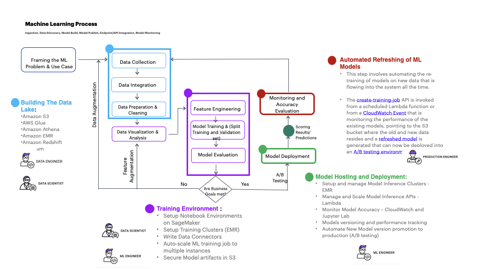

# Accenture ML CI/CD Pipeline

> Production-grade MLOps pipeline — AWS SageMaker · GitHub Actions · Docker  


---

## From POC to large-scale deployment

Most ML projects fail not because of bad models, but because of the gap between a proof-of-concept and a production-ready system. This project addresses that gap directly.



> *ML workflow and process — multiple teams collaborating to create a complete ML solution in production (source: AWS / Accenture whitepaper)*

The pipeline is built around three principles from the whitepaper:

| Principle | How this pipeline delivers it |
|---|---|
| **Repeatability** | Every push to `main` runs the identical 5-stage pipeline |
| **Scalability** | SageMaker auto-scaling (1→4 instances), Docker layer cache, OIDC auth |
| **Transparency** | Lineage tracking via SageMaker Tags + SSM, structured JSON logs, Slack alerts |

---

## Pipeline architecture

```
Push to main
     │
     ▼
┌─────────────────────┐
│  Stage 1            │  flake8 · black · isort · mypy · bandit
│  Lint & Test        │  pytest · coverage ≥ 70%
└────────┬────────────┘
         │
         ▼
┌─────────────────────┐
│  Stage 2            │  Docker BuildKit + GHA layer cache
│  Docker Build       │  Trivy CVE scan (CRITICAL/HIGH → fail)
│  & Push to ECR      │  Image tagged with git SHA
└────────┬────────────┘
         │
         ▼
┌─────────────────────┐
│  Stage 3            │  SageMaker endpoint deploy/update
│  Deploy to AWS      │  Waiter: blocks until InService
│                     │  Smoke test: real HTTP 200 check
└────────┬────────────┘
         │
         ▼
┌─────────────────────┐
│  Stage 4            │  Triggers SageMaker training pipeline
│  SageMaker          │  Duplicate execution guard
│  Pipeline Trigger   │  Lineage: Tags + SSM Parameter Store
└────────┬────────────┘
         │
         ▼
┌─────────────────────┐
│  Stage 5            │  Slack notification on success or failure
│  Notify             │
└─────────────────────┘
```

> `develop` branch → Stage 1 only  
> `main` branch → All 5 stages  
> Pull Request → Stage 1 only

---

## Project structure

```
Accenture-ML-cicd-project/
├── .github/
│   └── workflows/
│       └── ml-pipeline.yml       # 5-stage GitHub Actions pipeline
├── docker/
│   └── Dockerfile                # Multi-stage, non-root, pinned base
├── scripts/
│   ├── deploy_sagemaker.py       # Endpoint deploy + auto-scaling
│   ├── trigger_pipeline.py       # Pipeline trigger + lineage tracking
│   └── smoke_test.py             # Post-deploy endpoint validation
├── src/                          # ML model source code (add here)
├── tests/                        # Unit tests (add here)
├── requirements.txt              # Runtime dependencies only
├── requirements-dev.txt          # CI/dev dependencies (not in image)
├── pyproject.toml                # Centralized tool config
└── .gitignore
```

---

## Security improvements (v1 → v2)

| Area | v1 | v2 |
|---|---|---|
| AWS Auth | Long-lived access keys | OIDC — no permanent keys |
| Container user | root | non-root `appuser` (UID 1001) |
| Image scanning | None | Trivy — blocks on CRITICAL/HIGH CVE |
| Code security | None | Bandit static analysis |
| Permissions | Broad | Least privilege (`contents: read`) |

---

## Prerequisites

### GitHub Secrets required

Go to **Settings → Secrets and variables → Actions** and add:

| Secret | Value |
|---|---|
| `AWS_OIDC_ROLE_ARN` | `arn:aws:iam::ACCOUNT_ID:role/GitHubActionsRole` |
| `SAGEMAKER_ROLE_ARN` | `arn:aws:iam::ACCOUNT_ID:role/SageMakerExecutionRole` |
| `SLACK_WEBHOOK_URL` | Slack incoming webhook URL |

### AWS setup

1. Create an ECR repository named `ml-model`
2. Create a SageMaker execution role with S3 and ECR access
3. Set up GitHub OIDC provider in IAM ([AWS guide](https://docs.github.com/en/actions/deployment/security-hardening-your-deployments/configuring-openid-connect-in-amazon-web-services))

---

## Local development

```bash
# Clone
git clone https://github.com/serkan-usta/Accenture-ML-cicd-project.git
cd Accenture-ML-cicd-project

# Install dev dependencies
pip install -r requirements-dev.txt

# Run linting
flake8 src/ tests/
black --check src/ tests/
mypy src/

# Run tests
pytest tests/ --cov=src --cov-report=term-missing

# Build Docker image locally
docker build -f docker/Dockerfile -t ml-model:local .
```

---

## Lineage tracking

Every pipeline execution is recorded in two places:

- **SageMaker Tags** — `CommitSha`, `TriggeredBy`, `TriggeredAt`, `Source`
- **SSM Parameter Store** — `/ml-pipeline/last-execution/{pipeline-name}`

This directly implements the whitepaper's lineage requirement:
> *"Model artifact lineage should be recorded and tracked at every stage."*

---

## References

- [Amazon SageMaker Lineage Tracking](https://docs.aws.amazon.com/sagemaker/latest/dg/lineage-tracking.html)
- [GitHub Actions OIDC with AWS](https://docs.github.com/en/actions/deployment/security-hardening-your-deployments/configuring-openid-connect-in-amazon-web-services)
- [Trivy vulnerability scanner](https://github.com/aquasecurity/trivy-action)
